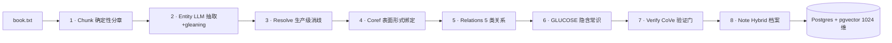

# 09 · LoreGraph（YunyueLi/LoreGraph）代码通读报告

> 通读日期：2026-08 ｜ 仓库：https://github.com/YunyueLi/LoreGraph ｜ 许可证：Apache-2.0
> 定位：**从虚构文本（小说/剧本/歌剧）构建"证据锚定的可查询知识图谱"**。8-Pass LLM 管线：分章 → 实体 → 消歧 → 共指 → 关系 → 常识事实 → 验证门 → 人物档案。**每条 claim 必须带可逐字回查的 `evidence_span`**，任何证据与原文非字面匹配的 claim 一律拒绝。
> 代码规模：`src/loregraph/` 约 9200 行 Python（9 个子包）；另有 web 前端、85 部多语言语料库（含西游记）、Alpha 状态、线上 demo（loregraph.ungetsu.net）。
> **这是用户方案「Map 层 + 证据锚定 + 中文消歧 + 质量门」目前完成度最高、且是 9 个旧项目之外新发现的单体实现，Apache-2.0 可商用。**

---

## 1. 项目概况与定位

LoreGraph 与常见"文档 → 三元组"工具的根本差异：**不信任 LLM 的自由抽取**。核心信条（README + CLAUDE.md 双重声明）：

> 每条抽取的 claim 携带 `evidence_span`（源文本的字面子串）；Pass-7 链式验证拒绝任何证据与原文 ≥95% 字面匹配不上的 claim。图是**闭世界**的：模型被明确要求忘记真实世界的"Elizabeth Bennet/孫悟空"，只报告这本书说了什么。

它同时做**多语言端到端**：85 部参考语料覆盖 11 种语言（Pride and Prejudice · 西游记 · 罪与罚 · 浮士德 · 悲惨世界…），源文本保持原文字形，实体消歧用多语言嵌入模型让"林黛玉/颦儿""Dark Lord/Voldemort"在零字符串重叠下合并为同一节点。

产品形态：每本书一个网页阅读室，五个视图共用同一张证据锚定图——Reader（原文实体高亮）/ Graph（力导向关系图，悬停边→来源句）/ Timeline（按阅读顺序的事件）/ Index（实体目录+档案卡）/ **Ask（基于图的问答，每个答案都引用证据）**。

**与用户方案的关系**：它的"8-pass 抽取 + 证据锚定 + 生产级消歧 + 成本工程"正好是定版方案"自建 Map 层"的现成候选；而它的 roadmap（narrative-time graph、faction 层、防剧透角色对话）恰恰是用户方案要补的时序/势力/防剧透三块——**它缺的部分正是我们要补的部分，重叠度极高**。

---

## 2. 整体架构与数据流

- Pass 1、4 确定性（零 LLM）；Pass 2、3、5、6、8 为 LLM；**Pass 7 是 ≥95% 字面匹配验证门**。
- 所有 LLM 调用走单一客户端（`llm/client.py`），集中做 prompt 缓存、token 记账、重试退避、成本上限。
- 全部异步、按 pass 提交事务、断点续跑（`--from N`），每本书有默认 $20 的 LLM 花费上限。

---

## 3. 模块逐文件代码通读

### 3.1 编排器 `pipeline/orchestrator.py`（441 行）★★

- `run(from_pass, to_pass)` 顺序执行 1..8，每个 pass 独立提交（跨 pass 不持有长事务），失败时回滚本 pass、落 FAILED 标记、**已提交的前序 pass 保留**，可 `--from N` 续跑。
- `_check_cost_ceiling`：每个 pass 后按 token 数 × 可配置单价估算花费，超 `cost_ceiling_usd`（默认 $20）即中止（可续跑）——**成本刹车**。
- `_gather_bounded`（并发上限 10）：LLM 调用并发化（顺序 20 分钟 → 约 2 分钟），DB 写入串行；单 chunk 失败跳过不杀死整个 pass；**认证类错误（401/403）与 >50% 失败率会中止而非静默标完成**——防"空 pass 假装 done"。
- 关键常量：`_MAX_CHUNK_ENTITIES=20`（单 chunk 送 Pass-5/6 的实体上限，防稠密章 prompt 爆炸）；`_MAX_NOTE_ENTITIES=800`（Pass-8 只给高频实体写档案）。
- Pass-3 后接 `_canonicalize_entities`：LLM 给实体打 `canon/faction/generic` 属性（GraphRAG 式，行者→孙悟空、取经队伍/天庭/妖魔打标签），best-effort 失败不影响落库。

### 3.2 分章 `pipeline/pass1_chunk.py`（218 行）★ 确定性

- 章节头正则同时匹配英文（Chapter 12 / CHAPTER IV / Chapter the First）与 **CJK（第\s*[〇零一二三四五六七八九十百千两\d]+\s*[回章卷節节折]）**。
- 反 TOC 防呆：标题 ≤120 字符、标题不延续成第二句、首字符非小写；**正文不足 50 tokens 的候选头判定为目录项丢弃**（丢目录行不丢正文——正文归属只到"被保留的头"为止）。
- 章内按段落切 600–1200 tokens、20% 字符重叠、超长段强制断行；产出 `atom_id = ch{NN}_p{PPP}`（可引用证据句柄）+ 全局 `story_pos`（阅读顺序位置）+ `content_hash`（增量检测）。

### 3.3 实体抽取 `pipeline/pass2_entity.py`（136 行）★

- LLM 输出 `{surface_form, type(Agent/Object/Event/Concept), evidence_span}`；**post-process 用 `find_literal_span` 校验 evidence_span 必须是 chunk 的字面子串，否则丢弃**（Pass-7 之前就清库）。
- `glean()`（`llm/gleaning.py`，64 行）：GraphRAG 式"你漏了什么"补抽循环，最多 2 轮、收敛阈 1 条，去重键 `(type, surface.lower())`。
- max_tokens 8192 给稠密 JSON 留空间（防截断成非法 JSON）；单 chunk JSON 解析失败只跳过该 chunk。

### 3.4 实体消歧 `pipeline/pass3_cluster.py`（345 行）★★（全书级消歧）

架构（对标 Splink/Zingg 阻塞→打分→聚类 + ComEM 批量 LLM 匹配 + sClust 黑洞守卫）：

1. **Blocking**（召回优先、候选有界）：词法门（子串/词重叠/编辑比）+ **嵌入 kNN**（多语言 e5-large，top-8）——kNN 抓"Dark Lord↔Voldemort、颦儿↔林黛玉"这类零重叠别名。把 O(n²) 配对空间压成有界候选图。
2. **Batched scoring**（ComEM "select" 策略）：**每个 anchor 的整组候选一次 LLM 调用**返回逐候选判定（O(anchors) 次调用而非 O(pairs)），批大小 10，候选打乱防位置偏差，置信度 ≥0.6 才合并。
3. **Clustering**：Union-Find → 连通分量。
4. **Transitivity guard**：连通分量会经弱链 A~B、B~C 黑洞式吞并 C；对每个 ≥3 别名簇跑一次 LLM sanity pass 拆出 outliers（`_cluster_outliers`）。
- canonical 名 = 高频者胜（并列取最长再按字典序）；`canonical_id` = sha1(type:name) 稳定 id。
- 嵌入阻塞失败（无 embedder）时词法门仍工作（降级不中断）。

### 3.5 共指绑定 `pipeline/pass4_coref.py`（v0.1 确定性）

- 表面形式查找表 `{(type, surface.lower()) -> entity_id}`，逐 mention 绑定。**代词/称谓共指（she/那小子/大夫）v0.1 不做**（v0.2 计划）——靠 Pass-2 prompt 禁止把裸代词当 Agent 来补（目标语料上仍覆盖 70–80%）。

### 3.6 关系抽取 `pipeline/pass5_relation.py`（151 行）★

- 只对"本章出现过的实体对"抽取（`chunk_entities` 由 Pass-4 的 mention 链接得到）。
- 硬校验：两端点必须在章实体表（防幻觉实体）、evidence_span 字面子串、confidence ∈ [0,1]、去自环。
- **双轴谓词**（`models/predicates.py`，1032 行，★★ 价值很高）：`predicate`（开放动词，供阅读，如 THREATENS_TO_BURN）+ `predicate_class`（**封闭类**，供查询，~24 种：MOTION/LOCATION/POSSESSION/EXCHANGE/KINSHIP/AUTHORITY/CONFLICT/AID/SOCIAL/SPEECH_*/BELIEF/EMOTION/PERCEPTION/TRANSFORMATION…）。背景数据：9843 条边上出现 2627 个不同谓词、1554 个只出现一次——"那是带箭头的自由文本，不是知识图谱"，所以必须有封闭轴；分类不了的落 `<RELATION>_OTHER`（诚实未分类 > 强行错分，_OTHER 占比是可观测可压低的数）。
- 5 类关系枚举（`RelationType`）：STRUCTURAL/INTERACTS/ASSERTS/INFLUENCES/PREDICTS；另带 weight + sentiment（positive/neutral/negative）。

### 3.7 隐含常识 `pipeline/pass6_glucose.py`

- GLUCOSE 五维 × 前后时态（cause/emotion/location/possession/attribute × before/after）的隐含事实抽取（"文本暗示但未明说"），每个事实带 `inference_depth ∈ {explicit, one_step, multi_step}`（深度随下游 Pass-7 收紧）。

### 3.8 验证门 `pipeline/pass7_cove.py`（443 行）★★★（质量核心）

**两个数字、两个职责**（CLAUDE.md 明确禁止混淆）：

| 指标 | 是什么 | 用途 |
|---|---|---|
| `literal_match_rate` | evidence_span 字面命中率 | **不变式 tripwire**：Pass-2/5/6 入库前已丢非字面 span，健康管线恒为 1.0；低于 0.95 只说明上游 span 处理有 bug |
| `supported_rate` | 抽样 claim 被法官判定为证据**蕴含**的比例 | **真正的质量数字**：引文再字面也可能不支持 claim |

- **分层抽样**（`stratified_sample`）：按 (relation/dimension × inference_depth) 分层按比例配额、每层至少 1 条，而非均匀抽样——均匀抽会 ~63% 是最好答的 INTERACTS/explicit，掩盖真正失败的层；`multi_step` 全部验证（最深推断、最易错、量小可负担）。
- 双闸门：字面率 <0.95 报 bug；supported_rate < 配置下限（`LOREGRAPH_COVE_SUPPORTED_FLOOR`）则**失败整个 run 供人工检查**（v0.1 不自动删，v0.2 才做自动清理）。
- `weakest_strata` 输出最差层，告诉运维"该修哪类 claim"。

### 3.9 人物档案 `pipeline/pass8_note.py`

- 对高频实体（≤800）聚合全部证据（mentions + 出入边 + glucose），LLM 合成**五段 Hybrid Note**：`[CONTEXT][FACTS][INFERENCES][GAPS][EVIDENCE]`——**事实与推断严格分离，推断带置信度**。
- 实体子类型封闭枚举（AGENT: Person/Clan/Community/Organization/Mythic…），LLM 输出归不进的回退 Other。

### 3.10 LLM 客户端 `llm/client.py`（446 行）★★（成本工程）

- **唯一 LLM 入口**：`LLMClient`（Protocol）+ `AnthropicLLMClient`（`cache_control: ephemeral` 显式 prompt 缓存，命中省 ~90% 输入）+ `OpenAICompatibleLLMClient`（base_url 可换，覆盖 OpenAI/DeepSeek/Kimi/GLM/Qwen/Groq/Grok/Gemini/Together/Fireworks/Mistral/**OpenRouter（默认，deepseek-v4-pro）**/Ollama/vLLM；OpenAI/DeepSeek 服务端自动缓存，`cached_tokens` 被读出记账）。
- 重试：6 次指数退避 + jitter（上限 ~120s），只重试瞬态错误（429/超时/连接/5xx），4xx 视为 bug 不重试。
- `LLMUsage` 全程 token/请求记账 → `pass_runs.stats`；`est_cost_usd` 供成本刹车。

### 3.11 数据模型与存储 `models/` + `db/schema.py`（304 行）

- 枚举（`enums.py`）：EntityType 4 类 / RelationType 5 类 / InferenceDepth 3 档 / GlucoseDim 5 维 / PassStatus。
- ORM 表：books / chunks / mentions / entities / edges / glucose_facts / pass_runs（+ Alembic 迁移、Pydantic↔ORM 同步测试）。Postgres 16 + pgvector（1024 维嵌入），**关系库而非图数据库**（区别于 Graphiti/Neo4j 路线）。
- `repository.py` 仅 179 行（薄封装）；`web/` FastAPI + 阅读室前端（五视图）。

### 3.12 工程外壳（职责记录）

- `cli/main.py`（265）：ingest/extract/status/view/eval 命令；`evals/`：graph/gaps（无需模型）/entailment/contamination/perturbation（需模型）。
- `config.py`（166）：全量环境变量（provider/model/价格/成本上限/CoVe 参数）。
- `utils/spans.py`（54）：`is_literal_match`（零归一化字面匹配，保真是硬要求）；`utils/clustering.py`（150）：Union-Find + 嵌入 kNN 候选生成。

---

## 4. 关键算法/机制深挖

1. **证据锚定全链路**：抽取（Pass-2/5/6）→ 入库前自检（is_literal_match）→ Pass-7 CoVe 门。字面率是 bug 探针，supported_rate 是质量数字——两指标分工明确，防止拿"字面命中率 100%"冒充质量。
2. **生产级实体消歧（成本-质量权衡典范）**：词法阻塞（零成本）→ 嵌入 kNN（本地免费）→ 批量 LLM 判定（O(anchors) 而非 O(pairs)）→ 黑洞守卫（仅大簇一次 sanity）。跨脚本别名（颦儿/林黛玉）靠多语言嵌入解决。
3. **双轴谓词**：开放动词（阅读）× 封闭类（查询）× 5 类关系（粗语义）三档粒度，`_OTHER` 兜底可观测。
4. **分层抽样验证**：质量审计不被"好答的多数"淹没；最深推断全量验证。
5. **成本工程三件套**：prompt 缓存（system prompt 保持稳定是前置条件，Anthropic 显式 breakpoint / DeepSeek 服务端自动）+ 有界并行 + 每 pass 幂等提交/断点续跑 + **每书 $20 硬上限**。
6. **闭世界纪律**：prompt 显式要求遗忘现实知识，防模型预训练知识泄漏（与 AI-Reader-V2 的幻觉孤岛过滤同思路但更根本）。
7. **故障哲学**：任何 LLM 步骤失败降级不中断（跳过/回退），但认证错误与 >50% 失败率中止——防"空 pass 假装 done"。

---

## 5. 与用户小说 RAG 方案的映射

| 用户方案组件 | LoreGraph 对应物 | 结论 |
|---|---|---|
| 章节 Chunk | Pass-1（英文 + CJK 第N回，段落感知，overlap） | ✅ 现成 |
| Map：Chapter Memory | Pass-2/5/6（实体/关系/常识事实，全部带证据） | ✅ **现成，字段语义强于 graph-every-novel** |
| 指代消解/别名 | Pass-3（阻塞+批量 LLM+黑洞守卫，跨脚本） | ✅✅ **生产级，与 AI-Reader-V2 同级** |
| 幻觉过滤/质量门 | Pass-7 CoVe（supported_rate 分层抽样门）+ 闭世界纪律 | ✅✅ **比"grounding 字符串过滤"更强的蕴含级验证** |
| 人物档案 | Pass-8 Hybrid Note（事实/推断分离） | ✅ 现成 |
| 势力/阵营标注 | Pass-3 canonicalize 的 `faction` 属性（取经队伍/天庭/妖魔） | ✅ 雏形现成，无时序 |
| 原文 Evidence | evidence_span + chunk 全文 + atom_id 可引用句柄 | ✅ 现成且是硬政策 |
| **势力变迁（时序）** | **roadmap：narrative-time graph（as-of chapter N 滑杆）** | ⚠️ 需自建（正好是用户方案方向） |
| **势力/社区层** | **roadmap：community/faction layer** | ⚠️ 需自建 |
| **防剧透角色问答** | **roadmap：grounded character chat（cited + spoiler-aware）** | ⚠️ 需自建 |
| **分层 Reduce（Arc/Book）** | **无**（无 Saga/卷摘要概念） | ⚠️ 需自建 |
| **伏笔状态机** | **无**（GLUCOSE 常识 ≠ 伏笔回收） | ⚠️ 需自建 |
| **查询路由 System-1/2** | **无**（Ask 是单一图问答） | ⚠️ 需自建 |
| 成本控制 | prompt 缓存 + 并发 + 断点续跑 + $20/书上限 + token 记账 | ✅✅ 全项目最强 |
| 增量更新 | **无**（每书全量重跑，断点是 pass 级非章节级） | ⚠️ 完结书无碍；连载需评估 |

---

## 6. 可复用模块清单

**直接复用（Apache-2.0，pip install 或 vendor）**
- 整个 8-pass 抽取管线（`pipeline/`）作为 Map 层。
- `evidence_span` 政策 + `utils/spans.py`（零归一化字面匹配）。
- `pass3_cluster.py` 实体消歧（阻塞 + 批量 LLM + 黑洞守卫）——中文别名合并的现成实现。
- `pass7_cove.py` 分层抽样 CoVe 验证门（supported_rate 质量审计模板）。
- `pass5_relation.py` 双轴谓词（predicate/predicate_class）——网文关系枚举的查询轴设计。
- `llm/client.py`：prompt 缓存、15+ 供应商、重试、token 记账、成本刹车。
- `pass8_note.py` Hybrid Note（事实/推断分离的人物档案）。
- `pass1_chunk.py` 分章器（CJK 第N回）。

**需改造**
- 抽取 prompt：语料是经典文学（红楼梦/西游记级），需按网文题材定制（玄幻/都市/科幻枚举、别称/外号、身份揭示字段）。
- 存储：Postgres+pgvector 关系库 → 若走 Graphiti/Neo4j 底座需转图；或接受关系库 + 自建时序层。
- 共指：v0.1 只做表面形式绑定，代词共指（网文高频的"他/那小子"）需补。
- 增量：按章节级增量（完结书可忽略）。

**仅参考**
- web 阅读室前端（若要可视化可借鉴）、85 部语料库（版权严格，源文本不入库）。

---

## 7. 许可证与工程坑

- **Apache-2.0** ✅ 可商用、可改、可闭源分发。
- **Alpha 状态**：README 明示 extraction engine 已生产加固、语料处理中；roadmap 四件事未完成（正是方案要补的）。
- **依赖**：Postgres 16+ pgvector、Python 3.11+、uv；LLM 建议结构化输出能力强的模型（DeepSeek V4 Pro 默认经 OpenRouter；小模型 JSON 遵循度差会掉 pass）。
- **实测坑**（README/CLAUDE.md）：单 chunk 稠密实体（西游记 50–60 个）会让 Pass-5/6 prompt 爆炸 + 403——`_MAX_CHUNK_ENTITIES=20` 已防；Anthropic prompt 缓存只在 `anthropic/*` 模型 + 显式 cache_control 生效，纯 OpenAI 兼容走服务端自动缓存；成本上限默认 $20，700 万字长书需按实测上调。
- 无 LICENSE 问题的对比：AI-Reader-V2（AGPL）不能直接抄代码，LoreGraph 可以整体 vendor。

---

## 8. 成本与规模实测数据

- README 声明：中等篇幅小说**分钟级**跑完（并发 + 缓存）；**每书默认 $20 成本上限**，token/费用全部落在 `pass_runs.stats`。
- 8-pass 调用结构：Pass-2/5/6 每 chunk 1 次（并发 10）+ gleaning 至多 2 轮 + Pass-3 按 anchor 批量（O(anchors)）+ Pass-7 抽样 150 + Pass-8 每实体 1 次（≤800）——**比 graph-every-novel（每章 3–5 次）调用更多但每次更小，且 prompt 缓存省 80–90% 输入**。
- 对用户 700 万字外推：8-pass 全量 + 缓存，成本区间与"定版组合"同量级（¥140–450 内），但需按长书实测调整 $20 上限与并发；**它自带的 token/费用记账与成本刹车是长跑刚需**。

---

## 9. 通读结论

1. **LoreGraph 是"Map 层 + 证据锚定"目前最完整的现成实现**：8-pass 管线、生产级中文/多语言消歧、蕴含级验证门、全项目最强的成本工程，Apache-2.0 可整体采用。定版方案的"自建 Map"应从 graph-every-novel 蓝本升级为"LoreGraph 整体候选"。
2. **它缺的恰好是定版方案要补的**：时序势力层、社区/阵营层、防剧透、分层 Reduce、伏笔状态机、多路检索路由——全部在其 roadmap 或缺失清单里。**"LoreGraph 为基础 + 在其上补分层/伏笔/检索"与"原定版拼装路线（graph-every-novel Map + Graphiti 底座）"是值得 P1 pilot 双线对照的两条路线**。
3. **最大差异点**：LoreGraph 用 Postgres+pgvector 关系库而非图数据库，无增量、无 Graphiti 式双时态；若接受关系库 + 自建时序层，路线 A 省力最多；若图/时序/增量是硬需求，路线 B 仍成立，但可把 LoreGraph 的 evidence_span + CoVe 门移植进路线 B 的 Map 层。
